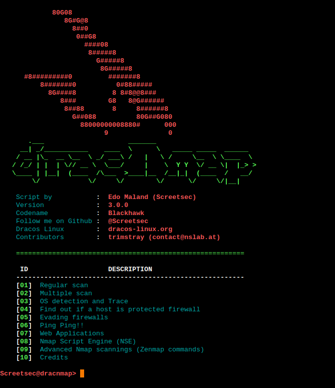

# What is Dracnmap?

[]()
[]()
[]()
[]()

**Dracnmap** is an open source tool which is using to exploit the network and gathering information with **Nmap** help.
**Nmap** command comes with lots of options that can make the utility more robust and difficult to follow for new users.
Hence **Dracnmap** is designed to perform fast scaning with the utilizing script engine of **Nmap** and **Nmap** can perform various automatic scanning techniques with the advanced commands.

## Version

Stable release: **v3.0.0**  
Testing release: **testing**

## Screenshot

  

# Getting started

1. ```chmod +x dracnmap```
2. ```sudo ./dracnmap or sudo su ./dracnmap```

# Testing environment

* `4.13.0-kali1-amd64 #1 SMP Debian 4.13.13-1kali1 (2017-11-17) x86_64 GNU/Linux`
* `GNU bash, version 4.4.12(1)-release`
* `Nmap version 7.60 ( https://nmap.org )`

# Requirements

- We recommend Kali Linux 2 or Kali 2016.3 rolling/Cyborg/Parrot/Dracos/BackTrack/Backbox and another GNU/Linux operating system
- [Nmap](https://nmap.org/)
- [Proxychains](http://proxychains.sourceforge.net/)

# Tutorial or another tool?

You can visit my channel: https://www.youtube.com/channel/UCpK9IXzLMfVFp9NUfDzxFfw

**TheFatRat**, Backdoor Creator (bypass av): https://github.com/Screetsec/TheFatRat

# Bugs

- See Issues page

- Contact:

  - **Edo Maland** (Screetsec) - author

    Hey sup? do you want ask about all my tools? You can join me in [telegram.me/offscreetsec](telegram.me/offscreetsec)

  - **[trimstray](https://github.com/trimstray)** - main contributor of the v3.0.0

# Changelog

Be sure to check out the [CHANGELOG.md](CHANGELOG.md).

# Donations

- If this project very help you to penetration testing and u want support author, you can give me a cup of coffee :)
- **Edo Maland**: [](https://blockchain.info/id/address/1NuNTXo7Aato7XguFkvwYnTAFV2immXmjS)

</img>

# Credits

- Thanks to allah and **Screetsec** [Edo -maland-] <Me>

- **Dracos Linux** from Scratch Indonesia (Awesome Pentesting OS), you can see in http://dracos-linux.org/

- **Offensive Security** for the awesome OS (http://www.offensive-security.com/)

- http://www.kali.org/

- And another open sources tool in github

- Up to date new tools hacking visit http://www.kitploit.com

- Contributors:

  - First Contribute - **@nullrndtx**


  - **Boy Suganda Sinaga** [dragz17]


  - **v3.0.0** - **[trimstray](https://github.com/trimstray)**

# Books for Nmap

- Nmap 6: Network exploration and security auditing Cookbook
- Nmap Host Discovery Techniques
- Nmap Cheat Sheet (PDF) - 8ack
- Nmap - A Stealth Port Scanner - Villanova Computer Science
- Nmap Quick Reference Guide - SCADAhacker

# Disclaimer

***Note: modifications, changes, or alterations to this sourcecode is acceptable, however,any public releases utilizing this code must be approved by writen this tool ( Edo -m- ).***
